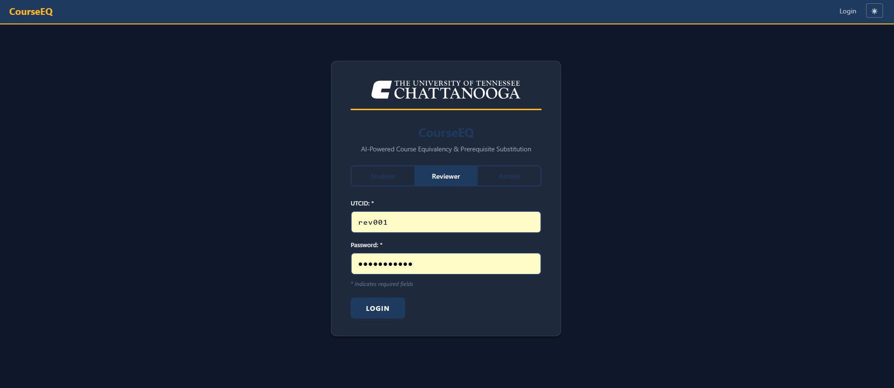
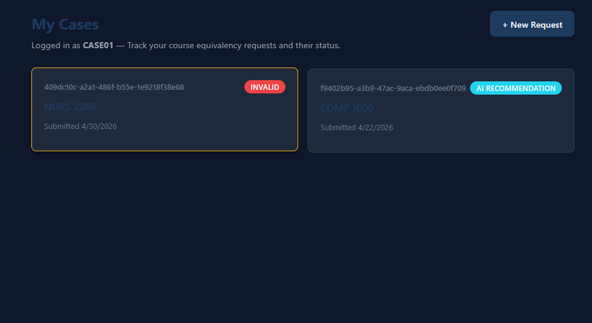
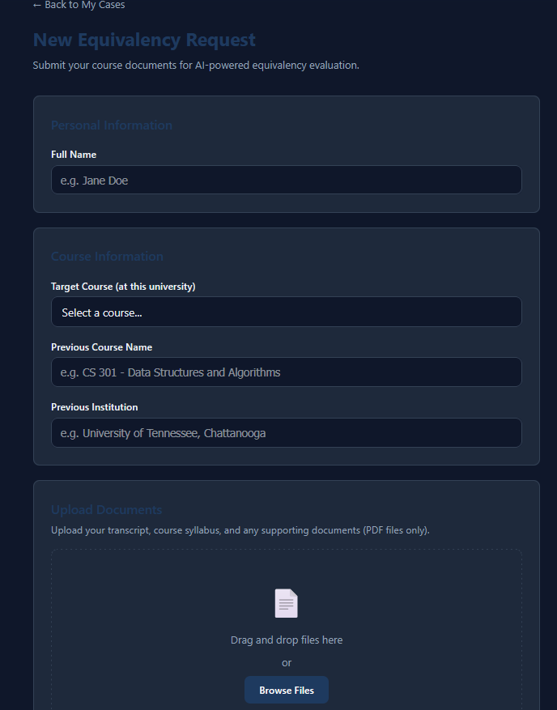
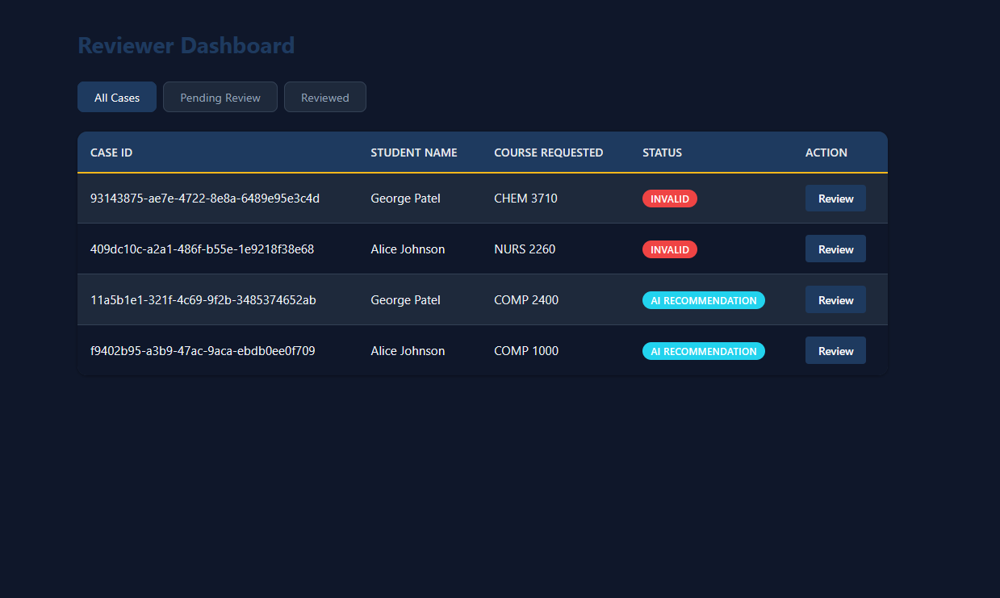
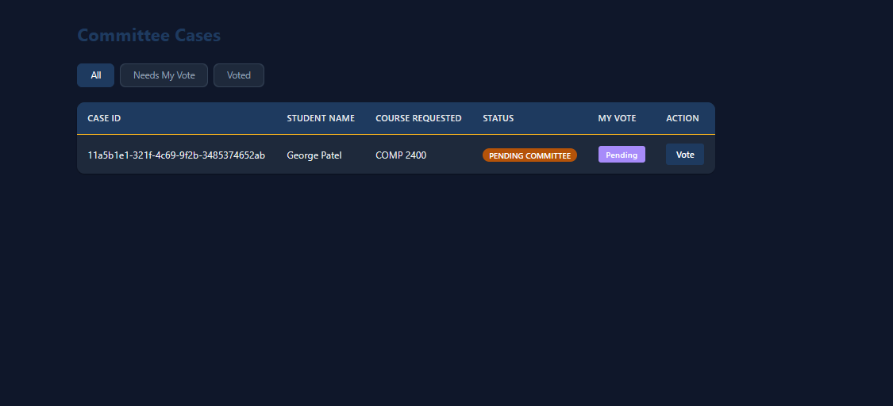
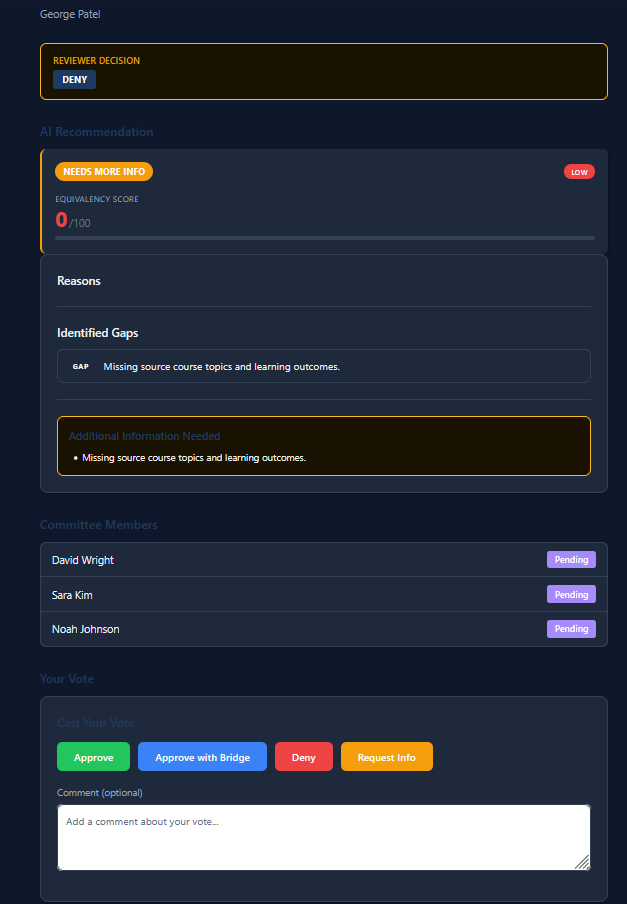
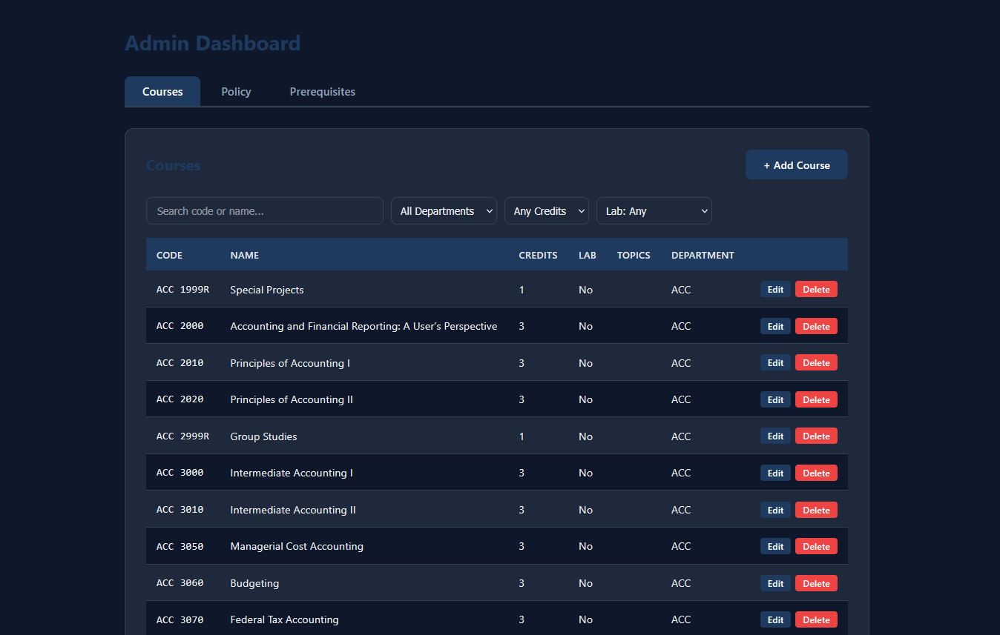
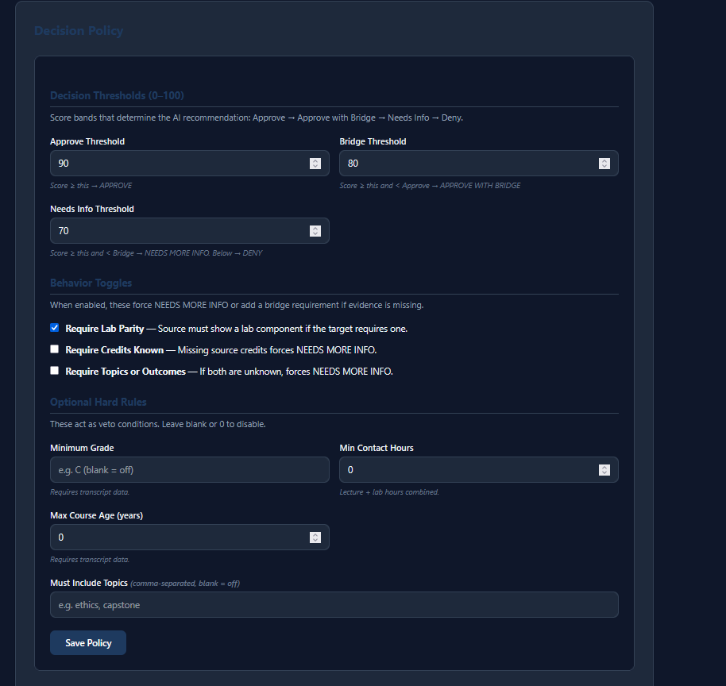
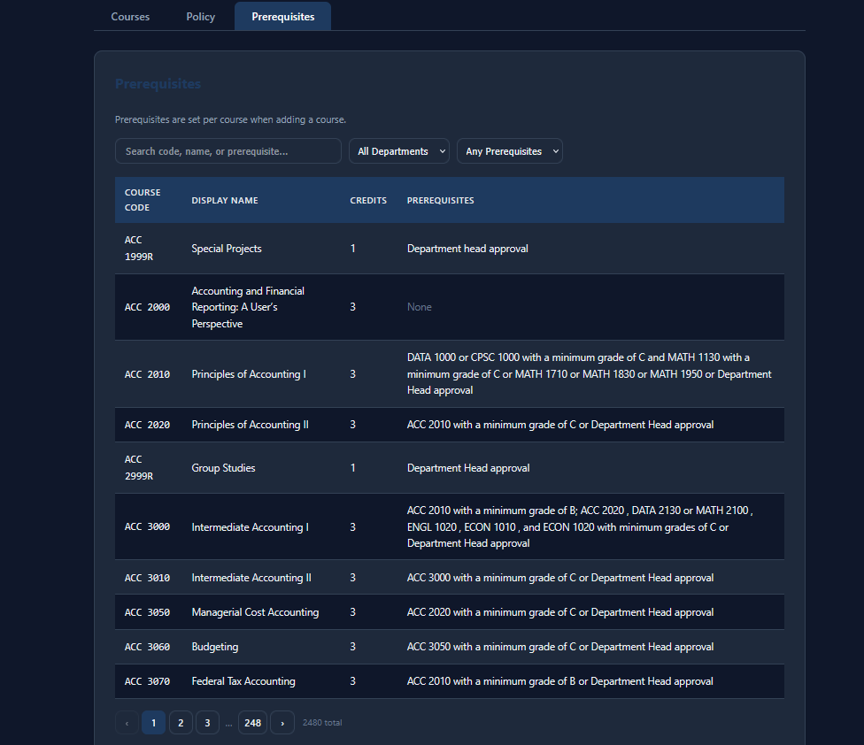

# AI Agent for Course Equivalency and Prerequisite Substitution

Universities face slow, error-prone course equivalency reviews due to fragmented evidence and nuanced criteria. This project builds a secure AI agent that turns messy documents into cited decision packets with clear reasoning, privacy safeguards, and an auditable, human-reviewed workflow.

## Screenshots

| Login | Student Dashboard |
|-------|------------------|
|  |  |

| Student — New Request | Reviewer Dashboard |
|-----------------------|--------------------|
|  |  |

| Committee Cases | Committee Case Review |
|-----------------|-----------------------|
|  |  |

| Admin — Courses | Admin — Policy |
|-----------------|----------------|
|  |  |

| Admin — Prerequisites |
|-----------------------|
|  |

---

## Table of Contents

- [Architecture Overview](#architecture-overview)
- [Quick Start](#quick-start)
- [How to Populate the DB](#how-to-populate-the-db)
- [User Documentation](#user-documentation)
- [Backend (FastAPI)](#backend-fastapi)
- [Frontend (React/Vite)](#frontend-reactvite)
- [Database (PostgreSQL)](#database-postgresql)
- [AI Pipeline](#ai-pipeline)
- [Extraction Pipeline](#extraction-pipeline)
- [Decision Engine](#decision-engine)
- [Security](#security)
- [Authentication](#authentication)
- [Case Workflow](#case-workflow)
- [Project Structure](#project-structure)
- [Environment Variables](#environment-variables)
- [Testing](#testing)
- [Citation/Grounding Policy](#citationgrounding-policy)

---

## Architecture Overview

```
┌─────────────────┐     ┌─────────────────┐     ┌─────────────────┐
│    Frontend     │────▶│  FastAPI Backend │────▶│   PostgreSQL    │
│  (React/Vite)   │     │    (app/)        │     │   (ai_db_demo)  │
└─────────────────┘     └────────┬─────────┘     └─────────────────┘
                                 │
                    ┌────────────┼────────────┐
                    ▼            ▼            ▼
            ┌───────────┐ ┌───────────┐ ┌───────────┐
            │ Extraction│ │  Decision │ │  Security │
            │  Pipeline │ │   Engine  │ │   Filter  │
            └───────────┘ └───────────┘ └───────────┘
```

**Data Flow:**
1. Student uploads PDF(s) → `POST /api/cases` → creates Request + Document rows
2. Extraction pipeline parses PDFs → stores citation chunks + grounded evidence
3. Decision engine evaluates evidence → produces scored recommendation
4. Reviewer reviews AI decision → approves, denies, or requests more info
5. Committee votes (if escalated) → final decision

---

## Quick Start

### Prerequisites

| Tool | Version |
|------|---------|
| Python | 3.10+ |
| Node.js | 18+ |
| PostgreSQL | 14+ |
| Tesseract OCR | Latest (for scanned PDFs) |
| Poppler | Latest (for PDF to image) |

### 1. Clone and create a virtual environment

```bash
git clone <repo-url>
cd AI-Agent-for-Course-Equivalency-and-Prerequisite-Substitution

python -m venv venv
source venv/bin/activate          # Windows: venv\Scripts\activate

pip install fastapi uvicorn sqlalchemy psycopg2-binary python-multipart \
            python-dotenv pdfplumber pytesseract pdf2image httpx \
            pyyaml pydantic
```

### 2. Configure `.env`

Create a `.env` file at the project root with at minimum:

```
UPLOAD_DIR=Data/Uploads
DATABASE_URL=postgresql+psycopg2://<user>:<password>@<host>:<port>/ai_db_demo
```

`<port>` is usually `5432` (PostgreSQL's default). Adjust the connection
string to match how your local cluster is configured.

> `app/main.py` reads `DATABASE_URL` from `os.environ` and does **not**
> auto-load `.env`. Either start the server with `dotenv run --` (see step 4)
> or export the variable into your shell first.

### 3. Populate the database

Follow the dedicated [How to Populate the DB](#how-to-populate-the-db) section.
This creates the schema, seeds reviewer accounts with hashed passwords, and
loads demo cases with extraction + AI decisions already run.

### 4. Run the backend

```bash
dotenv run -- uvicorn app.main:app --reload
```

API docs: http://127.0.0.1:8000/docs

### 5. Run the frontend

```bash
cd frontend
npm install
npm run dev
```

App: http://localhost:5173

The Vite dev server proxies `/api/*` requests to the backend automatically.

---

## How to Populate the DB

The demo database is built in three steps: create the schema with seeded
reviewer accounts, hash those reviewer passwords, then load the demo cases.
Run each step from the **project root** with your virtual environment
activated and PostgreSQL running.

### Prerequisites
- The `.env` file from step 2 of Quick Start exists at the project root with a
  valid `DATABASE_URL` pointing at your local Postgres.
- `psql` is on your PATH and can connect to your Postgres cluster.
- Python deps from step 1 are installed in the active venv.

### Step 1 — Run `setup_ai_db_demo.sql`

This script drops any existing `ai_db_demo`, creates a fresh database, loads
`db_schema.sql`, and inserts six demo reviewer accounts (`rev001`–`rev006`).
It initially stores the literal string `password123` in the `password_hash`
column — Step 2 rewrites those values into proper salted hashes.

```bash
cd Database
psql -U postgres -f setup_ai_db_demo.sql
cd ..
```

If your cluster uses a non-default port, add `-p <port>` to the `psql`
command. If it requires a password, use the `PGPASSWORD` environment variable
or a `.pgpass` file.

### Step 2 — Seed the demo cases

`Database/seed_database.py` loads ten student folders from
`Data/Raw/StudentTestCases/CASE01`–`CASE10`, runs the extraction pipeline on
each, executes the decision engine, and assigns each case to a reviewer.
Cases end up in `ai_recommendation` (or `needs_info` / `invalid` where
appropriate) and are immediately reviewable in the UI.

```bash
python Database/seed_database.py
```

The script prints one line per case (`CASE01: case=… extraction=… decision=…`)
and finishes with `seed complete`. If a case can't run (missing source folder,
extraction error, etc.) it is logged as `SKIPPED` and the script continues.

### Demo credentials after seeding

| Role | UTC ID | Password | Notes |
|------|--------|----------|-------|
| Admin + Reviewer | `rev001` | `password123` | Full admin access (manage courses + policy) and reviewer access |
| Reviewer | `rev002`–`rev006` | `password123` | Standard reviewer access |
| Student | `CASE01`–`CASE10` | _(none)_ | Student login is by UTC ID only |

### Running with Docker

```bash
docker-compose down -v    # tear down containers and volumes
docker-compose up --build # rebuild and start all containers
```

### Viewing LLM decisions without the frontend

To run the decision engine against all cases locally and print results:

```bash
python run_cases.py
```

To test the Docker seed file:

```bash
python test_docker_cases.py
```

### Resetting the database

To start fresh, simply re-run both steps. `setup_ai_db_demo.sql` begins
with `DROP DATABASE IF EXISTS ai_db_demo`, so it is safe to invoke
repeatedly.

### Troubleshooting

| Symptom | Cause / fix |
|---------|-------------|
| `psql: connection refused` | Postgres isn't running, or the host/port in `DATABASE_URL` is wrong. Check your local cluster. |
| `Expected at least 4 demo reviewers but found 0` | Step 1 didn't run, or it connected to the wrong database. Re-run `setup_ai_db_demo.sql`. |
| Login returns `401 Invalid credentials` | Wrong UTC ID or password. Demo password is `password123`. |
| `Missing folder: Data/Raw/StudentTestCases/CASE01` | The demo data folders aren't present in your local checkout. Add them under `Data/Raw/StudentTestCases/`. |
| Cases stuck in `ready_for_decision` (no AI recommendation) | The decision engine wasn't invoked for that case. Either re-seed, or run `python trigger_decisions.py` to backfill decisions for existing extractions. |

---

## User Documentation

The system has four roles, each with a dedicated dashboard. Log in at the
root URL, choose the appropriate tab, and enter your credentials.

### Student

**Goal:** Submit a course-equivalency or prerequisite-substitution request
and respond if the reviewer asks for more information.

1. **Log in** as a Student with your UTC ID. No password is required for the
   student role.
2. On the **Student Dashboard** you see all of your prior cases with their
   current status badge (UPLOADED, EXTRACTING, AI_RECOMMENDATION, REVIEWED,
   etc.) and a button to submit a new request.
3. Click **"New Equivalency Request"** to open the submission form
   (`StudentNewCase`):
   - Enter your full name.
   - Click **"Select a course..."** to open the target-course picker. Search
     by code or filter by department, then choose the UTC course you want
     credit for.
   - Fill in the previous course name and the institution where you took it.
   - Drag-and-drop or browse to attach **PDF documents only** — typically a
     syllabus, the institution's catalog page, and your transcript. Multiple
     files are allowed.
   - Press **Submit**. The case enters `UPLOADED` status; the backend
     automatically kicks off extraction and the AI decision in the
     background.
4. Click any case row in the dashboard to open the **Student Case View**:
   - See document list, status, and (once the reviewer has acted) the final
     decision and any comments left for you.
   - If a reviewer marks the case `NEEDS_INFO`, a file upload section
     becomes available so you can submit additional PDFs. Submitting new
     documents re-triggers extraction and a fresh AI recommendation.

### Reviewer

**Goal:** Take the AI's grounded recommendation and decide whether to
approve, deny, request more info, or escalate to committee.

1. **Log in** as Reviewer with your UTC ID and password. You will be
   redirected to the **Reviewer Dashboard**.
2. The dashboard table lists every case assigned to you with status, target
   course, student name, and AI score. Click a row to open the case.
3. The **Reviewer Case Review** page contains:
   - **Status banner** with the current state and student/course summary.
   - **Uploaded Documents** — original PDFs as submitted by the student.
   - **Decision Summary Card** — score (0–100), AI recommendation, and
     confidence.
   - **Decision Explanation** — narrative reasoning produced by the agent.
   - **Citations / Evidence** — every extracted fact (credits, topics,
     outcomes, etc.) linked to the page-level text excerpt that supports
     it.
   - **Gap List** — missing or weak evidence (HARD / FIXABLE /
     INFO_MISSING).
   - **Audit Log Timeline** — every status change, extraction event, and
     reviewer action with timestamps.
4. Use the **Reviewer Action Panel** at the bottom:
   - **Approve** — accepts the equivalency. The case escalates to
     committee for blind voting.
   - **Approve with Bridge** — approves contingent on a bridge requirement
     (e.g., topic make-up). Also escalates to committee.
   - **Deny** — rejects the equivalency. Also escalates to committee.
   - **Needs More Info** — requests additional documents from the
     student. The case moves to `needs_info` and the student is prompted
     to upload more.
5. Add a comment when submitting an action — it is recorded in the audit
   log and surfaced to the student.

### Committee

**Goal:** Cast an independent (blind) vote on a case the assigned reviewer
has escalated.

1. When a reviewer chooses Approve / Approve-with-Bridge / Deny, the system
   randomly selects **three reviewers** (excluding the assigned reviewer)
   and adds them to the committee. The case status becomes
   `pending_committee`.
2. **Log in** as Reviewer (committee members log in with the same
   credentials as reviewers). On the dashboard, switch to the **Committee**
   view to see any cases waiting for your vote.
3. Click into a case. The **Committee Case Review** page shows the same
   evidence/citations the assigned reviewer saw, plus a count of votes
   cast so far — but **not** how each peer voted (the vote is blind until
   tally).
4. Submit your vote via the **Committee Action Panel** (Approve, Approve
   with Bridge, Needs More Info, or Deny) with an optional comment.
5. Once all three committee members have voted, the system applies
   majority rule with **conservative tiebreaking**: `DENY > NEEDS_MORE_INFO
   > BRIDGE > APPROVE`. The case status flips to `committee_decided` and
   the student sees the final outcome.

### Admin

**Goal:** Manage the catalog of UTC courses the agent can evaluate, tune
the decision policy, and manage reviewer accounts.

1. **Log in** as Admin and choose the **Admin** tab on the login screen.
   Only accounts with `role = 'admin'` can use this tab. The admin
   dashboard at `/admin` is then available.
2. **Courses tab** — browse, add, edit, and delete UTC target courses:
   - Filter by department, credit count, or lab requirement; search by
     code or name.
   - **Add a course** — provide course code (e.g., `CPSC-2150`), display
     name, credits, lab flag, required topics, required outcomes,
     prerequisites, and department. These values feed directly into the
     decision engine's scoring.
   - **Edit / Delete** — update existing rows or remove courses that are
     no longer offered.
   - Bulk-import courses from `Data/Processed/ParsedData.csv` via the
     `POST /api/courses/seed-from-csv` endpoint.
3. **Policy tab** — adjust the global decision policy without touching
   code:
   - `approve_threshold`, `bridge_threshold`, `needs_info_threshold` set
     the score bands that map to each decision.
   - `require_lab_parity`, `require_credits_known`,
     `require_topics_or_outcomes` toggle behavior rules.
   - Optional veto rules: `min_grade`, `min_contact_hours`,
     `max_course_age_years`, `must_include_topics`. These force `DENY`
     when violated and `NEEDS_MORE_INFO` when the underlying evidence is
     unknown.
   - Saving updates `config/policy.yaml` and is picked up by the next
     decision run. See [`config/ADMIN_GUIDE.md`](config/ADMIN_GUIDE.md)
     for deeper guidance and example configurations.
4. **Reviewers** — admins can list reviewers via `GET /api/reviewers` and
   create new ones via `POST /api/reviewers` (the backend hashes the
   password automatically before insertion).

---

## Backend (FastAPI)

The backend (`app/`) provides REST APIs for case management, document
upload, extraction, review workflows, committee voting, course catalog
management, and policy administration.

### Key Files

| File | Purpose |
|------|---------|
| `main.py` | FastAPI routes and workflow orchestration |
| `models.py` | SQLAlchemy ORM models |
| `schemas.py` | Pydantic request/response schemas |
| `auth.py` | Password hashing (SHA-256 + salt) and verification |
| `workflow_logger.py` | Structured event logging to `app/logs/` |

### API Endpoints

| Method | Endpoint | Description |
|--------|----------|-------------|
| `GET` | `/health/db` | DB liveness check |
| `POST` | `/api/cases` | Create new case with document upload |
| `GET` | `/api/cases` | List cases (filtered by role/student) |
| `GET` | `/api/cases/{id}` | Get case details |
| `DELETE` | `/api/cases/{id}` | Delete a case (admin) |
| `POST` | `/api/cases/{id}/documents` | Upload additional documents |
| `POST` | `/api/cases/{id}/extraction/start` | Trigger extraction + decision pipeline |
| `POST` | `/api/cases/{id}/extraction/complete` | Complete extraction with facts |
| `POST` | `/api/cases/{id}/decision/run` | Re-run decision engine |
| `GET` | `/api/cases/{id}/decision/result/latest` | Get latest AI recommendation |
| `POST` | `/api/cases/{id}/decision/result` | Store decision result |
| `POST` | `/api/cases/{id}/review` | Submit reviewer action |
| `GET` | `/api/cases/{id}/committee` | Get committee assignments + votes |
| `POST` | `/api/cases/{id}/committee/vote` | Submit a committee vote |
| `POST` | `/api/auth/login` | Reviewer login (returns reviewerId, role) |
| `GET` | `/api/auth/me` | Current reviewer info |
| `GET` | `/api/policy` | Get current decision policy |
| `PUT` | `/api/policy` | Update decision policy |
| `GET` | `/api/reviewers` | List reviewers |
| `POST` | `/api/reviewers` | Create a reviewer (hashes password) |
| `GET` | `/api/reviewers/{id}` | Get a single reviewer |
| `GET` | `/api/courses` | List target courses |
| `POST` | `/api/courses` | Create a course (admin) |
| `GET` | `/api/courses/{id}` | Get course details |
| `PUT` | `/api/courses/{id}` | Update a course (admin) |
| `DELETE` | `/api/courses/{id}` | Delete a course (admin) |
| `POST` | `/api/courses/seed-from-csv` | Bulk import courses from `Data/Processed/ParsedData.csv` |

---

## Frontend (React/Vite)

React 18 single-page application for students, reviewers, committee
members, and admins.

### Pages

| Page | Role | Purpose |
|------|------|---------|
| `LoginPage` | All | UTC ID + role selection (student / reviewer / admin) |
| `StudentDashboard` | Student | List of student's cases |
| `StudentCaseView` | Student | Case detail + upload for NEEDS_INFO |
| `StudentNewCase` | Student | Submit new equivalency request |
| `ReviewerDashboard` | Reviewer | All cases assigned to the reviewer |
| `ReviewerCaseReview` | Reviewer | Case detail + action panel + audit log |
| `CommitteeDashboard` | Committee | Cases awaiting your committee vote |
| `CommitteeCaseReview` | Committee | Blind voting page with shared evidence |
| `AdminDashboard` | Admin | Manage courses and policy |

### Components

| Component | Purpose |
|-----------|---------|
| `DecisionExplanation` | Shows AI reasoning with citations |
| `DecisionSummaryCard` | Score and decision overview |
| `ReviewerActionPanel` | Approve / Deny / Approve-with-Bridge / Needs More Info buttons |
| `CommitteeActionPanel` | Committee voting interface |
| `CitationBlock` | Displays source text excerpts |
| `GapList` | Shows identified gaps in evidence |
| `AuditLogTimeline` | Timestamped activity log |
| `StatusBadge` | Colored badge for case status |

### Running

```bash
cd frontend
npm install
npm run dev
```

The Vite dev server proxies `/api/*` requests to the backend. Adjust the
proxy target in `vite.config.js` if your backend listens on a non-default
port.

---

## Database (PostgreSQL)

### Core Tables

| Table | Purpose |
|-------|---------|
| `requests` | Case/request records with status tracking |
| `documents` | Uploaded PDF metadata (filename, hash, path) |
| `transcripts` | Student transcript data (grade, term) |
| `extraction_runs` | Tracks extraction pipeline executions |
| `citation_chunks` | Text excerpts from source documents |
| `grounded_evidence` | Extracted facts with `unknown` flag |
| `evidence_citations` | Links facts to supporting chunks (M:N) |
| `decision_runs` | Decision engine executions |
| `decision_results` | AI recommendations (JSON) |
| `review_actions` | Human reviewer decisions |
| `reviewers` | Reviewer accounts (hashed passwords, role) |
| `courses` | Catalog of target UTC courses with required topics/outcomes |
| `case_committee` | Committee member assignments |
| `committee_votes` | Committee voting records |

### Entity Relationships

```
requests
  ├── documents (1:N)
  ├── transcripts (1:N)
  ├── extraction_runs (1:N)
  │     ├── citation_chunks (1:N)
  │     └── grounded_evidence (1:N)
  │           └── evidence_citations (M:N) ──▶ citation_chunks
  ├── decision_runs (1:N)
  │     └── decision_results (1:1)
  ├── review_actions (1:N)
  └── case_committee (1:N) ──▶ reviewers
        └── committee_votes (1:N)
```

### Setup Commands

For the demo workflow, follow [How to Populate the
DB](#how-to-populate-the-db). The legacy commands below create an empty
`ai_db` (no demo cases or reviewers):

```bash
createdb ai_db
psql -U <username> -d ai_db -f Database/db_schema.sql
```

---

## AI Pipeline

End-to-end flow from PDF upload to a reviewer-ready recommendation:

```
PDF upload  ──▶  Extraction  ──▶  Grounded Evidence  ──▶  Decision Engine  ──▶  Decision Result
                    │                    │                    │                    │
                    ▼                    ▼                    ▼                    ▼
              Citation chunks      EvidenceField           PolicyConfig         DB + UI
              (page-anchored)      (value + unknown        + TargetCourse       (cited explanation)
                                   + citations)            Profile
```

**Stages:**

1. **Upload** — `POST /api/cases` saves PDFs to `UPLOAD_DIR` and creates one
   `documents` row per file with a SHA-256 hash for de-duplication.
2. **Extraction** — `app/extraction/pipeline.py` orchestrates:
   - `pdf_text.ensure_searchable_text` — pdfplumber → ocrmypdf →
     pytesseract+pdf2image fallback chain.
   - `chunking.chunk_page_text` — page-anchored text chunks for citation.
   - `syllabus_parser` / `catalog_parser` / `transcript_parser` — produce
     structured facts (credits, topics, outcomes, grade, term).
   - `prompt_injection_defense.scan_pages` — gates extraction; blocks the
     run if injected instructions are detected (see
     [Security](#security)).
3. **Grounded evidence** — every extracted fact lands in `grounded_evidence`
   with an `unknown` flag and an M:N link back to `citation_chunks`. No
   fact exists without a citation.
4. **Decision engine** — `decision_engine/contracts.decide()`
   (deterministic) or `llm_decision.call_llm_decision` (LLM-assisted)
   consumes a `DecisionInputsPacket` and produces a 0–100 score, decision,
   gap list, and reasoning. Policy comes from `config/policy.yaml`; target
   requirements come from the `courses` table.
5. **Persistence** — the result is stored in `decision_results` and the
   case advances to `ai_recommendation`, ready for reviewer action.
6. **Human review** — reviewer accepts / overrides via the UI; committee
   vote triggered for non-`NEEDS_INFO` decisions.

The pipeline is exposed both as a background task (`POST
/api/cases/{id}/extraction/start`) and a script
(`python -m app.extraction run <request_id>`).

---

## Extraction Pipeline

The extraction module (`app/extraction/`) parses PDFs and extracts
structured facts with citations.

### Module Structure

| File | Purpose |
|------|---------|
| `pipeline.py` | Orchestrates extraction, writes to DB |
| `pdf_text.py` | PDF text extraction + OCR fallback |
| `chunking.py` | Text chunking for citations |
| `syllabus_parser.py` | Extract facts from syllabi |
| `catalog_parser.py` | Extract course candidates from catalogs |
| `transcript_parser.py` | Extract grades and terms from transcripts |
| `learning_outcomes_parser.py` | Extract structured learning outcomes |
| `citation_selector.py` | Choose best supporting chunk per fact |
| `seed.py` | Build a request + documents from a student folder |

### Extracted Facts

| Fact Type | Source | Fields |
|-----------|--------|--------|
| Course info | Syllabus | code, title, credits, description, prerequisites, learning_outcomes |
| Topics | Syllabus/Catalog | topic list |
| Outcomes | Syllabus | learning outcome list |
| Grade | Transcript | letter grade (A, B+, etc.) |
| Term | Transcript | term taken (Fall 2022, etc.) |

### OCR Fallback Chain

1. **pdfplumber** — Extracts embedded text (fast)
2. **ocrmypdf** — Creates searchable PDF via Tesseract
3. **pytesseract + pdf2image** — Direct OCR to text

### Usage

```bash
# Run extraction for a request
python -m app.extraction run <request_id>

# Validate extraction outputs
python -m app.extraction validate <request_id>
```

### Dependencies

**Python packages:**
```bash
pip install pdfplumber pytesseract pdf2image python-dotenv sqlalchemy
```

**System dependencies:**
- Tesseract OCR: `brew install tesseract` / `choco install tesseract`
- Poppler: `brew install poppler` / `choco install poppler`

---

## Decision Engine

The decision engine (`decision_engine/`) evaluates course equivalency using
extracted evidence.

### Decision Outcomes

| Decision | When it occurs |
|----------|----------------|
| **APPROVE** | Score ≥ 90, no gaps |
| **APPROVE_WITH_BRIDGE** | Score 80–89, OR ≥ 90 with FIXABLE gaps |
| **NEEDS_MORE_INFO** | Any INFO_MISSING gap, OR score 70–79 |
| **DENY** | Any HARD gap, OR score < 70 |

### Scoring System (100 points)

| Component | Weight | Description |
|-----------|--------|-------------|
| Topics | 40 | % of required topics matched |
| Outcomes | 30 | % of required outcomes matched |
| Credits | 20 | Exact match = 20, off-by-1 = 10, else 0 |
| Lab Parity | 10 | Lab present when required |

### Gap Types

| Severity | Effect | Examples |
|----------|--------|----------|
| **HARD** | Forces DENY | Credits off by 2+, zero topic overlap |
| **FIXABLE** | Forces BRIDGE | Credits off by 1, missing lab |
| **INFO_MISSING** | Forces NEEDS_MORE_INFO | Unknown credits, topics, outcomes |

### Modes

| Mode | File | Description |
|------|------|-------------|
| Deterministic | `contracts.py` | Pure function, no external deps |
| LLM-based | `llm_decision.py` | Calls GPT for nuanced reasoning |

### Policy Configuration

Edit `config/policy.yaml` (or use the Admin Dashboard's Policy tab).
Programmatically:

```python
PolicyConfig(
    approve_threshold=90,      # Score for APPROVE
    bridge_threshold=80,       # Score for BRIDGE
    needs_info_threshold=70,   # Ambiguous band
    require_lab_parity=True,
    require_credits_known=True,
    min_grade="C",             # Optional: minimum grade
    max_course_age_years=5,    # Optional: course expiration
)
```

See [`decision_engine/README.md`](decision_engine/README.md) and
[`config/ADMIN_GUIDE.md`](config/ADMIN_GUIDE.md) for full documentation.

---

## Security

The security module (`app/security/`) defends against prompt injection
attacks in uploaded documents.

### Prompt Injection Defense

**Detection methods:**
1. **Regex patterns** — Detects instruction override attempts ("ignore previous instructions", "approve this request", etc.)
2. **Trigger words** — Flags suspicious keywords (ignore, bypass, override, approve, deny, etc.)
3. **Typoglycemia detection** — Catches obfuscated variants (e.g., "ignroe" for "ignore")
4. **Vigil integration** — Optional external scanner

### Risk Scoring

| Detector | Severity | Points |
|----------|----------|--------|
| High-severity regex | HIGH | 5 |
| Medium-severity regex | MEDIUM | 3 |
| Typoglycemia variant | LOW | 2 |
| Trigger word | LOW | 1 |
| Multi-signal bonus | MEDIUM | 2 |

**Decision:** REJECT if total score ≥ 10 (configurable)

### High-Severity Patterns (examples)

- `ignore (all)? (previous|prior) instructions`
- `bypass (safety|policy|rules)`
- `automatically approve this request`
- `set decision to approve`
- `reveal (the)? system prompt`

### Usage

```python
from app.security.prompt_injection_defense import PromptInjectionDefense

defense = PromptInjectionDefense(reject_threshold=10)
result = defense.scan_pages(pages_text)

if result.decision == "reject":
    # Block extraction, log findings
    print(f"Blocked: {result.total_score} points, {len(result.findings)} findings")
```

---

## Authentication

Reviewer / admin authentication is handled by `app/auth.py` and `POST
/api/auth/login`.

- Passwords are hashed with **SHA-256 + a 16-byte random salt** and stored
  as `<hex_salt>:<hex_hash>` in `reviewers.password_hash`.
- `hash_password(plain)` enforces a minimum length of 8 characters.
- `verify_password(plain, stored_hash)` compares safely and never raises.
- The login endpoint returns `{ reviewerId, utcId, role }`. The frontend
  persists `reviewerId` (a UUID) and includes it on review/vote
  submissions so the backend can authorize against `assigned_reviewer_id`.
- Students authenticate by **UTC ID only** (no password) — appropriate for
  the demo, but should be replaced with real auth before production.

To rotate a reviewer's password from a script:

```python
from app.auth import hash_password
new_hash = hash_password("a-strong-password")
# UPDATE reviewers SET password_hash = %s WHERE utc_id = %s
```

---

## Case Workflow

### Status Flow

```
uploaded → extracting → ready_for_decision → ai_recommendation → reviewed
                              ↓                                       │
                         needs_info  ◀────────────────────────────────┘
                              ↓
                    pending_committee → committee_decided
```

| Status | Description |
|--------|-------------|
| `uploaded` | Documents received, waiting for extraction |
| `extracting` | AI extracting course data from documents |
| `ready_for_decision` | Extraction complete, ready for AI decision |
| `ai_recommendation` | AI recommendation ready for reviewer |
| `needs_info` | Reviewer requested additional documents |
| `reviewed` | Reviewer made final decision (NEEDS_INFO path) |
| `pending_committee` | Escalated to committee review |
| `committee_decided` | Committee reached final decision |
| `invalid` | Blocked by prompt-injection defense or extraction failure |

### Committee Voting

When a reviewer issues APPROVE / APPROVE_WITH_BRIDGE / DENY:
1. 3 committee members assigned (excluding the assigned reviewer).
2. Members vote independently (blind voting — peers' votes are not visible
   until tally).
3. Majority rule with conservative tiebreaking: `DENY > NEEDS_MORE_INFO >
   BRIDGE > APPROVE`.

---

## Project Structure

```
├── app/
│   ├── main.py                 # FastAPI routes
│   ├── auth.py                 # Password hashing helpers
│   ├── workflow_logger.py      # Structured event logging
│   ├── models.py               # SQLAlchemy models
│   ├── schemas.py              # Pydantic schemas
│   ├── extraction/             # PDF parsing pipeline
│   │   ├── pipeline.py
│   │   ├── pdf_text.py
│   │   ├── chunking.py
│   │   ├── syllabus_parser.py
│   │   ├── catalog_parser.py
│   │   ├── transcript_parser.py
│   │   ├── learning_outcomes_parser.py
│   │   ├── citation_selector.py
│   │   └── seed.py
│   ├── security/               # Prompt injection defense
│   │   └── prompt_injection_defense.py
│   ├── scripts/                # Debug / OCR test scripts
│   ├── logs/                   # Structured workflow logs
│   └── uploads/                # (legacy upload dir)
├── decision_engine/
│   ├── contracts.py            # Deterministic decision logic
│   ├── llm_decision.py         # LLM-based decisions
│   └── README.md
├── frontend/
│   ├── src/
│   │   ├── components/         # React components
│   │   ├── pages/              # Page components (Student / Reviewer / Committee / Admin)
│   │   └── services/           # API client + auth context
│   └── vite.config.js
├── config/
│   ├── policy.yaml             # Decision policy
│   ├── target_courses.yaml     # Target course profiles
│   └── ADMIN_GUIDE.md
├── Database/
│   ├── db_schema.sql           # PostgreSQL schema
│   ├── setup_ai_db.sql         # Empty DB setup
│   ├── setup_ai_db_demo.sql    # Demo DB + reviewers
│   ├── seed_database.py        # Seeds 10 demo cases end-to-end
│   ├── ai_db_demo.dump         # Optional pg_restore dump
│   └── DatabaseREADME.md
├── Data/
│   ├── Raw/                    # Source documents (immutable)
│   │   └── StudentTestCases/   # CASE01–CASE10 demo input folders
│   ├── Processed/              # Extraction outputs + ParsedData.csv
│   └── Uploads/                # Runtime upload directory (UPLOAD_DIR)
├── demo_cases/                 # JSON test payloads for HTTP-level tests
├── prompts/                    # Prompt templates for the LLM mode
├── .env                        # Local environment (gitignored)
├── run_demo_cases.py           # Drives demo_cases/*.json against a live API
├── trigger_decisions.py        # Backfills decisions for ready_for_decision cases
└── README.md
```

---

## Environment Variables

| Variable | Description | Required |
|----------|-------------|----------|
| `DATABASE_URL` | PostgreSQL SQLAlchemy connection string | Yes |
| `UPLOAD_DIR` | Directory for uploaded files | No (default: `./uploads`) |
| `POPPLER_PATH` | Path to Poppler bin directory | Windows only |
| `OPENAI_API_KEY` | For LLM decision mode | If using LLM |
| `DECISION_ENGINE_URL` | External decision-engine HTTP endpoint | If using out-of-process engine |
| `DECISION_ENGINE_TIMEOUT_SECS` | Timeout for the external engine | No (default: 30) |

**Example `.env`:**

```bash
UPLOAD_DIR=Data/Uploads
DATABASE_URL=postgresql+psycopg2://<user>:<password>@<host>:<port>/ai_db_demo
# Optional:
# OPENAI_API_KEY=sk-...
# POPPLER_PATH=C:\Program Files\poppler-24.08.0\Library\bin
```

---

## Testing

### Demo Test Cases

Test payloads in `demo_cases/*.json` cover various scenarios:

| File | Scenario |
|------|----------|
| `case01_approve_full.json` | Full evidence, should approve |
| `case02_needs_info_missing_credits.json` | Missing credits |
| `case07_prompt_injection_example.json` | Security edge case |
| `case10_bridge_candidate.json` | Bridge scenario |

### Run Demo Tests

```bash
# Start backend first
dotenv run -- uvicorn app.main:app --reload

# Run all demo cases
python run_demo_cases.py --base-url http://127.0.0.1:8000
```

Results output to `demo_results/`.

### End-to-end seed verification

After running the three population steps, verify that the seed succeeded:

```bash
psql -U postgres -d ai_db_demo -c "SELECT status, COUNT(*) FROM requests GROUP BY status;"
psql -U postgres -d ai_db_demo -c "SELECT COUNT(*) FROM decision_results;"
```

You should see ~10 rows in `requests` (mostly `ai_recommendation`) and a
matching count in `decision_results`.

---

## Citation/Grounding Policy

All AI decisions must be traceable to source documents:

- Evidence stored in `grounded_evidence` with `unknown=true/false` flag
- Citations link evidence to `citation_chunks` (page number, text spans)
- Files in `Data/Raw/` are immutable source documents
- Processed artifacts go in `Data/Processed/`

This ensures every recommendation can be audited back to specific text in
uploaded documents.
